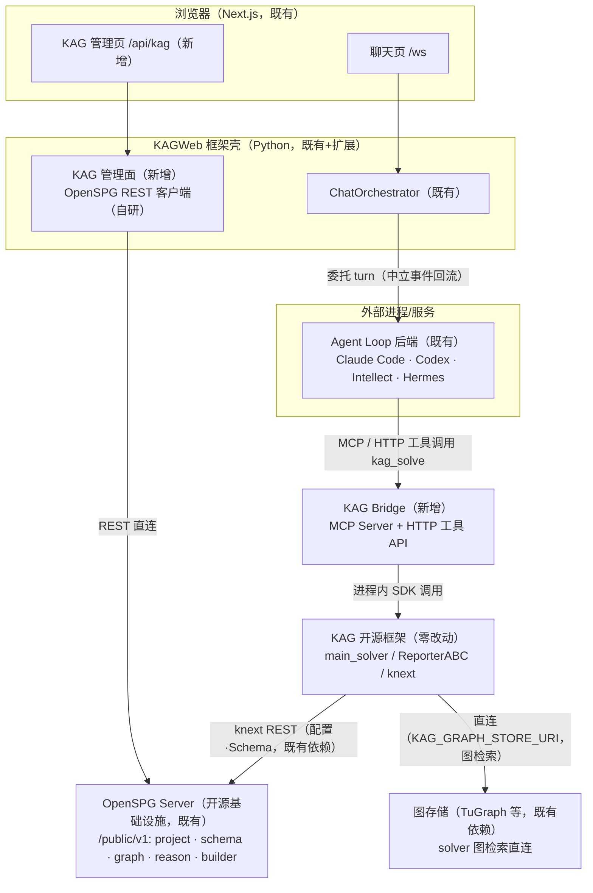
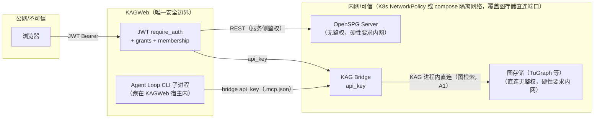

# KAG × KAGWeb 集成设计（定稿 v1.2）

> 状态：已评审定稿（含评审修正项 R1–R6、Bridge 演进路径、前端接入设计 §5.4、二轮评审修正 A1/A2/D1–D4、附录 A 契约样本）
> 日期：2026-09-18（v1.2 二轮评审修订；v1.1 增补前端接入设计与 M0 脚本评审修复）
> 代码基线：kagweb（本仓库）、`~/project/KAG`（KAG 开源框架）、`~/project/openspgapp`（闭源参考，不进入任何交付物）

---

## 1. 背景与设计原则

KAGWeb 作为 OpenSPG/KAG 生态的**开源 WebUI**，三条设计原则：

1. **KAG 由 KAGWeb 管理**——项目管理、Schema 管理、任务监控的管理面落在 KAGWeb；
2. **KAG 的推理以插件形式接入 Agent Loop**（Claude Code、Codex、Intellect Agent/Team、Hermes 等）——Agent Loop 功能不在 KAGWeb 或 KAG 端实现，KAGWeb 保持"框架壳 + 委托"架构不变；
3. **暂不修改 KAG 代码**——所有适配经 KAG 公开/内部既有 API 完成（稳定性风险见 §7 与 §8 演进路径）。

补充约束（合规）：

- openspgapp（闭源：OpenSPG 产品 UI + 产品 REST + pemja 桥）**只做功能参考，不包含、不拷贝、不翻译其代码**；
- OpenSPG server（开源引擎）作为**部署依赖**经 REST 对接，不嵌入代码；**部署物必须来自独立开源发行版（如 OpenSPG/openspg），不得使用闭源 openspgapp 仓库内的构建产物**（发行版来源与 License 于 M0 验证，§10 第 9 项）；
- KAG 仓库（Apache-2.0）允许被 Bridge 进程内 import 使用。

## 2. 依赖关系（修正后）

```
KAG（开源推理框架）──REST（配置·Schema）──▶ OpenSPG Server（开源基础设施）
  │            ▲                            ▲
  │            │ 进程内调用                   │ REST（/public/v1/*，原生 API）
  │       KAG Bridge（新增）            KAGWeb 管理面（新增）
  │            ▲                            ▲
  │            │ MCP/HTTP 工具调用            │ 既有委托机制
  │       Agent Loop 后端 ◀──── KAGWeb 对话编排（ChatCapability）
  │
  └──直连──▶ 图存储（TuGraph 等：solver 图检索经 KAG_GRAPH_STORE_URI/本地图，不经 REST）
```

要点：

- KAG 的项目配置/Schema 依赖 OpenSPG server（`kag/common/conf.py` 生产路径经 `ProjectClient` 拉取）；**图检索则直连图存储**（`knext/reasoner/client.py` 的 `generate_graph_connect_config()`：`KAG_GRAPH_STORE_URI` + 凭据，缺省本地图 `LOCAL_GRAPH_STORE_URL`），不经 `/public/v1` REST（评审 A1 修正）。图存储（TuGraph 等）因此是**独立的部署依赖**，内网隔离边界须覆盖其直连端口（§6.1）。Bridge 进程内调 KAG 时该依赖链**原样保留，零额外适配**；
- 闭源 openspgapp 产品层（`api/http-server` + `biz` + `core` 的产品 REST、pemja 桥 `bridge.spg_server_bridge`、产品 UI）**整体退场**，由 KAGWeb 承接其 UI/管理面角色；
- openspgapp 经 pemja 调 KAG 的先例证明"外部桥接层驱动 KAG solver"是官方认可形态；KAG Bridge 是其开源替代（协议为 MCP/HTTP 而非 pemja）。

## 3. 现状分析（关键事实与证据）

### 3.1 KAG（`~/project/KAG`）

| 事实 | 证据 |
|---|---|
| 双包结构：`kag/`（solver/builder）、`knext/`（CLI 与 REST 客户端）；CLI：`kag`、`knext`（project/schema/reasoner/thinker） | `setup.py` entry points；`knext/command/knext_cli.py` |
| 本地推理入口：`qa(task_id, query, project_id, host_addr, app_id, params)` → `do_qa_pipeline(use_pipeline, query, qa_config, reporter, task_id, kb_project_ids)` → `SolverPipelineABC.from_config(...).ainvoke(query, reporter)` | `kag/solver/main_solver.py` L151/L219 |
| 事件钩子：`ReporterABC.add_report_line(segment, tag_name, content, status, **kwargs)`；`OpenSPGReporter` 已实现 SubGraph/RefDocSet/Metrics 组装 | `kag/interface/solver/reporter_abc.py` L17；`kag/solver/reporter/open_spg_reporter.py` L171 |
| knext REST 客户端统一前缀 `/public/v{version}`，直连 OpenSPG server 原生 API（如 `ReasonerApi.reason_run_post → /reason/run`） | `knext/common/rest/api_client.py` L93–L102 |
| 生产环境项目配置从 OpenSPG server 拉取，server 返回的 `host_addr` 写回 `config["project"]` | `kag/common/conf.py` L119–L145 |
| KAG solver 配置支持 MCP executor 概念 | `kag/solver/main_solver.py` L141 |
| solver 图检索**直连图存储**：`KAG_GRAPH_STORE_URI`（含 user/password/database）或缺省本地图 `LOCAL_GRAPH_STORE_URL`，不经 `/public/v1` REST（评审 A1） | `knext/reasoner/client.py` L72–L103 |

### 3.2 OpenSPG server（`openspgapp/openspg/server`，开源引擎）

| 事实 | 证据 |
|---|---|
| 原生 API 面：`/public/v1/project`（创建/查询/更新，创建时初始化默认 Schema）、`/public/v1/schema`（alterSchema/queryProjectSchema）、`/public/v1/graph`（upsert/delete/writerGraph/子图查询）、`/public/v1/reason`（DSL/规则推理）、`/public/v1/builder/kag/submit`（KAG_COMMAND 构建任务） | `openspg/server/api/http-server/.../openapi/{ProjectController,SchemaController,GraphController,ReasonController,BuilderController}.java` |
| **全部 `/public/v1/*` 端点无 token/header 鉴权**：`userNo`/`tenantId` 是请求字段，信任调用方；图写入同样无鉴权 | 同上各 Controller 的 `check()` 均为空或仅校验参数 |
| 租户/项目模型：独立 `/public/v1/tenant` API；Project 字段含 `userNo/name/namespace/tag/visibility/config`，按 `tenantId/projectId` 查询 | `openapi/TenantController.java`；`openapi/ProjectController.java` L109–L145 |
| 可选权限模型：`hasPermission(userNo, resourceId, resourceTag)`，按控制器显式调用、非中间件强制 | `permission/PermissionController.java` L59–L62 |

### 3.3 KAGWeb（本仓库）

| 事实 | 证据 |
|---|---|
| 壳架构：`ChatOrchestrator → CapabilityRegistry → ChatCapability → AgentLoopBackend`；无工具层，agent-loop 后端自带工具生态 | `ARCHITECTURE.md` |
| 中立事件协议 `EVENT_KINDS`（含 `tool_call`/`tool_result`）；HTTP `custom-http` 契约（POST turn，SSE/NDJSON 中立帧） | `kagweb/services/agent_loop/protocol.py` L35–L47；`http_backend.py` |
| 认证：JWT bearer（`AUTH_SECRET`，用户存 `data/user/auth_users.json`，首注册用户自动 admin；可选 PocketBase 模式）；`require_auth()`/`require_admin()` 依赖 | `kagweb/services/auth.py` L1–L24/L242–L316；`kagweb/api/routers/auth.py` L263–L374 |
| 多用户 grants：`models.llm`、`exec_enabled`、`agent_loop`、`agent_loop_cli` 维度 | `kagweb/multi_user/grants.py` L15–L43 |
| 资源隔离：`data/user`（admin 工作区）、`data/users/<uid>`（用户工作区）、`data/system`（accounts/grants/audit/per-owner secrets） | `kagweb/multi_user/paths.py` |
| per-user 外部凭证先例：`/api/settings/agent-loop/identity` → `data/system/user-secrets/<owner>/private/intellect-agent/`（0600、读写校验 owner） | `kagweb/api/routers/settings.py` L890–L952 |
| session workspace：CLI 后端每会话工作目录；子进程 env allowlist（部署密钥不进子进程） | `ARCHITECTURE.md` CLI family 一节 |

## 4. 总体架构



新增组件仅三个：**KAG Bridge**（独立服务，§5.1）、**KAG 管理面**（§5.2）、**对话链路接线**（§5.3，KAGWeb 内小改）。KAG 与 OpenSPG server 的既有依赖链不动。

## 5. 组件设计

### 5.1 KAG Bridge

**定位**：独立的 Python 服务（首版独立包 `kag-bridge`），把 KAG 框架包装成 Agent Loop 可调用的工具。**不是 agent loop**——不做规划/多轮编排/工具循环，只做协议适配与 SDK 封装（该边界为永久不变量，见 §8）。

**工具面（首版）**：

| 工具 | 作用 | 底层 |
|---|---|---|
| `kag_solve(question, project_id, use_pipeline?)` | LLM 增强推理，返回答案+引用 | `do_qa_pipeline(...)`，显式传自有 reporter |
| `kag_schema(project_id)` | Schema 摘要（只读） | knext `SchemaSession`（经 `ReasonerClient`）→ `/public/v1/schema` |
| `kag_status()` | 健康与项目连通性 | — |
| `kag_reason`（M3 可选） | DSL/规则推理透传 | `/public/v1/reason` |

**多轮语义（评审修正 R2）**：`kag_solve` 为**无状态单问单答**——多轮上下文由 agent loop 负责拼装并写入工具描述（agent 需携带前文）；M0 顺带验证 KAG 是否存在 memorizer 类机制作为 M3 增强。

**事件桥接（评审修正 R1）**：自定义 reporter **继承 `OpenSPGReporter`**（KAG 仓库内，Apache-2.0，可直接复用），重写 `do_report()` 把"推送给 server 的流"改为"入本地事件队列"，再转 MCP progress notification / SSE `progress` 帧；终态经 `tool_result` 返回答案 + 引用（RefDocSet）+ 轨迹（SubGraph/Metrics，数据模型沿用 OpenSPGReporter 已有组装）。

**双协议**：

- **MCP Server**：Claude Code（session workdir `.mcp.json` 自动发现 / `--mcp-config`）、Codex（config.toml）原生支持；
- **HTTP 工具端点**：KAGWeb `custom-http` 风格中立帧（SSE/NDJSON，`{kind, text, name, data}`），供 Intellect/Hermes 在自身工具体系注册。

**并发与超时（评审修正 R3）**：Bridge 内设并发信号量（超限排队，排队/执行超时返回结构化 `error` 帧向上传导）；agent loop 的 turn `timeout_seconds`（默认 900s）覆盖全链路；取消 = 取消 `ainvoke` 任务。

**部署**：独立容器（KAG 依赖较重），仅内网监听，api_key 鉴权；KAG 的运行环境经环境变量/配置文件**独立注入**——含 LLM 凭据（评审修正 R5：不做对 KAGWeb settings 的反向依赖；与 KAGWeb provider 打通为 M3+ 可选项）与 `KAG_PROJECT_HOST_ADDR`、`KAG_GRAPH_STORE_URI` 等（图检索直连图存储，A1；图存储端口纳入隔离边界）。

### 5.2 KAGWeb 管理面

**对接目标**：OpenSPG server 原生 `/public/v1/*`，**不经过、不依赖**闭源 openspgapp 产品层。REST 客户端自研（Python httpx），契约以 KAG 开源仓库的 knext 客户端模型为权威参考（它是 `/public/v1/*` 的官方消费方）。

| 管理功能 | OpenSPG 端点 | 备注 |
|---|---|---|
| 项目列表/创建/详情 | `/public/v1/project` | 创建时 server 端初始化默认 Schema |
| Schema 查看/编辑 | `/public/v1/schema`（`alterSchema`/`queryProjectSchema`） | 首版只读 Schema 树 + 表单式编辑；图可视化用现成渲染库，画布式编辑后置 |
| 图数据浏览 | `/public/v1/graph` 子图查询 | 数据抽检 |
| 知识构建任务 | `/public/v1/builder/kag/submit` + 任务查询 | M4 |
| DSL/规则推理（可选） | `/public/v1/reason` | 与 kag_solve 互补 |

**实现落点**：

- 配置域：`data/user/settings/system.json` 新增 `kag` 块（§6.3），走既有 `RuntimeSettingsService`；
- 后端：`kagweb/services/kag/`（OpenSPG REST 客户端 + Bridge 客户端）+ `kagweb/api/routers/kag.py`；
- 前端：`web/features/kag/` 页面（Next.js 既有体系内自研，功能布局可参考 openspgapp UI 的信息架构；接入细则见 §5.4）；
- 会话绑定：session 增加可选 `kag_project` 字段，绑定校验 membership + grant（§6.4）。

**推理任务模型（评审修正调整 2）**：不复刻 openspgapp 的 `ReasonTaskRepository` 状态机。正常路径中 KAG 推理即聊天中的工具调用记录（`tool_call`/`tool_result` 已被 session 历史持久化）；Bridge 在 `kag_solve` 完成时向 KAGWeb 上报任务摘要（question/project/耗时/引用），存 KAGWeb 既有 SQLite/PocketBase，供管理面"推理任务列表"查询。

### 5.3 对话链路接线（KAGWeb 内小改）

1. **Turn 准备**：会话绑定 KAG 项目时，ChatCapability 在 prompt 注入 grounding 块（项目元数据、Schema 摘要、`kag_solve` 工具说明与无状态语义提示）；
2. **CLI 后端**：在 session workdir 生成 `.mcp.json` 指向 Bridge——M1 注入**实例级 bridge api_key**（调用在 Bridge 侧按 `session_id` 归因；per-session token 签发列为 M3 强化，见附录 A.3），Claude Code 自动发现；凭据经 profile `env` 块走既有 allowlist 机制；
3. **HTTP 后端**：Intellect/Hermes 在各自工具配置注册 Bridge；KAGWeb 负责配置下发与 manifest 提示；
4. **过程呈现**：agent loop 调 `kag_solve` 产生 `tool_call`/`tool_result` 中立事件 → 既有 StreamBus → UI 工具卡片。复用中立事件通道，但 Bridge 自身契约（MCP schema + SSE 帧）为新增面，需文档化。

### 5.4 前端接入设计（KAG 管理面 UI）

**结论**：管理面前端完全在现有框架内实现，零风格冲突、零新增依赖（图可视化复用既有 cytoscape）；三个硬约束由既有 CI 门禁强制，违反即 `check:fast` 失败，不存在"无意违反"。

**现状基线**（2026-09-18 实测）：

| 事实 | 说明 |
|---|---|
| `web/features/` 现为 5 域：capabilities、chat、multi-user、runtime-status、settings | `frontend-architecture.md` §3 所列 knowledge/co-writer 域已随 RAG 移除（2026-09-11，见 `ARCHITECTURE.md`），该文档此节已过期，以实况为准 |
| `(utility)` 路由组现有 settings / profile / space / avatar-preview | KAG 管理页与它们同级；`(workspace)` 属对话主工作区，非 turn-taking 页面不进 |
| 图可视化依赖已在：cytoscape + cytoscape-dagre、mermaid、chart.js | Schema 图与子图渲染零新增依赖 |
| 契约生成线：`contracts/schema/openapi.json` → openapi-typescript → `contracts/generated/api.ts` | `/api/kag/*` 前端类型必须走此线 |

**接入点映射**：

| 层 | 落点 | 依据/先例 |
|---|---|---|
| 路由 | `(utility)` 组新增 `/kag` 路由组（项目列表/详情/任务）；登录门禁由 `proxy.ts` 统一处理 | settings/space/profile 同组先例 |
| Feature 模块 | `web/features/kag/`：`model/`（Schema 树转换、图数据→节点/边模型、任务状态机；纯 TS、Node 测试）+ `api.ts`（transport）+ `components/` | 现行 5 域公共范式：`model/` 为公共核心，`store/`/`transport/` 按需 |
| API 类型 | 后端 `kag` router 进 OpenAPI → 重新生成 `contracts/generated/api.ts` | 契约驱动是硬机制（`contracts:check` 守护） |
| Settings 区块 | `features/settings/navigation/settings-nav.ts` 加一级 route `/settings/kag`（`adminOnly: true`），区块组件参照 Agent Loop 设置区（profile 卡片/检测徽章/primary 选择器模式） | settings-nav 一级真实 route + 锚点子项模型；`adminOnly`/`SettingsDomainGate` 可见性控制 |
| API 调用 | 一律 `apiUrl()` + `apiFetch`（cookie、401 跳转内置） | `shared/api/client.ts`；子路径部署规则（AGENTS.md Web Rule） |
| 图可视化 | 复用 cytoscape + cytoscape-dagre | 技术栈 §1 既有依赖 |
| UI 组件/样式 | 复用 `shared/ui` 与既有组件；Tailwind token + CSS 变量（`globals.css`）；不引入新组件库 | "无重型组件库、组件自研" |
| i18n | 全部文案 `t()`：英文原文即键（`keySeparator: false`）、zh 懒加载补齐 | `no-literal-ui-text` ESLint 规则 + `i18n:check` parity |
| 权限显隐 | `kag.projects` grant 控制导航与页面显隐（参照 `SettingsAccessProvider` 从 auth status 解析权限的模式）；未配置 `kag` settings 域时页面隐藏 | identity 卡片"无服务时隐藏"先例 |

**三个硬约束**（自动化守门）：

1. **分层依赖**：`features/kag/model/` 不得 import app/components/context（depcruise `feature-domain-does-not-render`；`shared-does-not-depend-on-ui`、`no-circular`、`no-route-page-imports` 同步生效）；
2. **契约类型**：`/api/kag/*` 的前端类型必须从 OpenAPI 生成，不得手写（`contracts:check` 守护同步）；
3. **文案**：JSX 与 title/placeholder/alt/aria-label 裸字面量被 ESLint 拦截，强制走 `t()`（`i18n:check` 校验 en/zh 键集一致）。

**注意事项**：

1. **route budget**：图浏览页含 cytoscape，bundle 偏大——`scripts/route_budgets.mjs` 需为 `/kag/*` 路由设置体积预算（`perf:check` 守护）；
2. **子图数据量**：`/public/v1/graph` 查询结果可能很大，在 `/api/kag` 侧完成分页/裁剪后再进前端，不在渲染层处理大对象；
3. **不复活旧 knowledge 域**：KAG 管理面填补 RAG/Knowledge UI 移除后的空位，但按本设计全新实现，不参照已移除域的代码组织（其 `api/` 目录形态不在现行 5 域范式内）；
4. **页面权限语义**：管理页读写需 membership + `kag.projects` grant（§6.4）；`/settings/kag` 区块仅 admin（§6.2）。

## 6. 鉴权与租户映射设计（新增）

### 6.1 信任模型



分层：

| 边界 | 机制 | 依据 |
|---|---|---|
| 浏览器 → KAGWeb | 既有 JWT（`require_auth`/`require_admin`） | KAGWeb 唯一公网入口 |
| KAGWeb → OpenSPG server | **无上游鉴权可用**（实测：`/public/v1/*` 无 token 校验，图写入裸奔）→ **硬性部署要求：仅内网** | §3.2 证据 |
| KAGWeb → Bridge | 内网 + api_key（服务间） | Bridge 以服务权限跑 KAG |
| Agent Loop CLI 子进程 → Bridge | `.mcp.json` 注入**实例级 bridge api_key**（M1；仅 Bridge 权限、不含 OpenSPG 直连能力，调用在 Bridge 侧按 `session_id` 归因；per-session token 签发为 M3 强化，附录 A.3）；经 env allowlist 下发 | 复用既有机制 |
| Bridge（KAG 进程内）→ 图存储 | 直连（`KAG_GRAPH_STORE_URI` + 凭据），无鉴权端口 → 与 OpenSPG server 同一隔离区 | 评审 A1；§3.1 证据 |

**核心结论：OpenSPG server 是"信任调用方"的内网服务，KAGWeb 是整个体系唯一执行鉴权的边界**。因此管理面所有端点必须在 KAGWeb 侧完成认证（JWT）与授权（grants + membership），OpenSPG 侧不做二次校验。

### 6.2 认证链路

- 沿用既有 `require_auth()`（`Authorization: Bearer` / `dt_token` cookie）作为 `kag` 路由的统一依赖；
- `kag` settings 域（§6.3）为 **admin-only**（沿 `/api/settings/agent-loop` 先例，`require_admin`）；
- 管理面变更类端点（项目创建、`alterSchema`、构建提交）加 **same-origin guard**（沿 `origin_is_trusted` 既有模式，防跨站 JSON POST 副作用）；
- 非 admin 用户访问管理面：走 grants + membership 门禁（§6.4），不默认 admin-gated（与 `/api/settings/agent-loop/identity` 的非 admin 先例一致）。

### 6.3 租户与项目映射（三阶段）

**阶段 T1（MVP，单租户）**——实例级映射：

```json
// data/user/settings/system.json 新增 "kag" 块（admin-only）
{
  "kag": {
    "spg_server_url": "http://openspg-server:8887",  // 端口以实际部署为准（KAG 侧默认 8887，SolverMain.invoke）
    "tenant_id": "<OpenSPG tenant id>",
    "service_user_no": "kagweb",        // 账号格式需满足 server 端校验（M0 实测，§10 第 10 项）
    "bridge_url": "http://kag-bridge:8930",
    "bridge_api_key": "<write-only secret>",
    "default_project_id": ""
  }
}
```

- KAGWeb 实例 ↔ 一个 OpenSPG tenant；所有调用以 `service_user_no` 归因；
- 项目可见性：`/public/v1/project` 按 `tenantId` 拉全量列表，KAGWeb 内部按 membership 过滤后返回前端；
- 控权完全由 KAGWeb grants 承担。

**阶段 T2（M4，多用户项目 ACL）**——KAGWeb 自建项目成员模型：

- 新增 `kag_project_members`（KAGWeb 存储）：`project_id ↔ owner/members`，管理面维护；
- 管理面读写按 membership 过滤/门禁；session 绑定 `kag_project` 时校验 membership；
- **归属归因**：调用 OpenSPG 时 `userNo = "kagweb-<uid>"`（稳定派生），使 server 侧记录可追溯到 KAGWeb 用户；`service_user_no` 仅用于无用户上下文的系统调用（如健康检查）。

**阶段 T3（可选，M5+，深度映射）**——仅在需要 OpenSPG 侧原生权限体系时：

- per-user OpenSPG 凭证走 identity-link 模式（`data/system/user-secrets/<owner>/private/openspg/`，0600、读写校验 owner，完全复用 intellect-agent 先例）；
- 或调用 `PermissionController.hasPermission(userNo, resourceId, resourceTag)` 委托判断；
- 不作为默认路径：OpenSPG 的权限 API 是按控制器显式调用的可选模型，深度耦合收益有限。

### 6.4 权限与 grant 设计

新增 `kag` grant 维度（沿 `agent_loop` 维度先例，`kagweb/multi_user/grants.py`）：

| grant | 控制点 |
|---|---|
| `kag.solve` | 对话中允许 agent loop 调 `kag_solve`（turn 准备时校验；未授予则不注入 grounding 块与 `.mcp.json`） |
| `kag.projects` | 管理面读写（项目/Schema/图浏览；写操作另需 membership） |

- admin 隐含全部 `kag` grant；
- 未启用 `kag` settings 域时，grant 不生效、页面隐藏（沿"无 agent 服务时隐藏 identity 卡片"的既有做法）。

### 6.5 凭证管理

| 凭证 | 存储 | 轮换 |
|---|---|---|
| Bridge api_key | `kag` settings 块，`GET /api/settings/kag` 脱敏返回（沿 agent-loop api_key write-only 先例） | admin 手动 |
| `.mcp.json` 内 bridge key | session workdir（M1 为实例级 bridge api_key：仅 Bridge 权限、不含 OpenSPG 直连能力，Bridge 侧按 `session_id` 归因；per-session token 为 M3 强化，附录 A.3） | 随 bridge api_key |
| OpenSPG 侧（T1/T2） | 无需凭证（内网）；settings 预留 `headers` 字段 | — |
| per-user OpenSPG 凭证（T3） | `data/system/user-secrets/<owner>/private/openspg/` | 用户自管 |

### 6.6 审计

- 管理面变更（项目创建/更新、`alterSchema`、构建提交、member 变更）写入既有 `multi_user` audit；
- `kag_solve` 调用即 session 内 `tool_call`/`tool_result` 事件（已持久化），Bridge 上报的任务摘要补齐管理面视角；
- OpenSPG 侧 `userNo`（`kagweb-<uid>`）提供跨系统归因。

## 7. "不改 KAG"证据链与边界

| 需求 | KAG 既有接口 | 稳定性 |
|---|---|---|
| 执行推理 | `do_qa_pipeline()` / `qa()`（`kag/solver/main_solver.py`） | **内部模块路径，无稳定性承诺**（`qa()` 签名已见变动）——Bridge 钉 KAG 版本，CI 加版本矩阵 |
| 流式事件 | `ReporterABC` + 继承 `OpenSPGReporter` | 同上 |
| 项目/配置 | `ProjectClient` / `KAGConfigAccessor` | knext 公开客户端 |
| Schema | knext `SchemaSession`（经 `ReasonerClient` 使用，`knext/schema/client.py`） | 同上 |
| DSL 推理（可选） | `ReasonerClient.execute()` | 同上 |

结论：当前约束下"零改动"成立，但属**内部 API 依赖**；由 §8 的 Bridge 上游化路径从根本上解除。

## 8. Bridge 演进路径（成熟后并入 KAG）

| 阶段 | 形态 | 内容 |
|---|---|---|
| **1（M1–M3）** | 独立包 `kag-bridge` | 独立仓库，依赖 `kag`（钉版本）；快速迭代工具面；MCP/SSE 契约文档化 |
| **2（M4+）** | optional extra `kag[mcp]` | 代码入 KAG 仓库，服务依赖不进核心 requirements；入口为 `kag` CLI 服务子命令；`kag_solve` 契约冻结 |
| **3（成熟期）** | KAG 官方服务层 | `do_qa_pipeline`/`ReporterABC` 成为公开 API；Bridge 与 KAG 的 CLI/SDK 并列为服务形态；闭源 pemja 桥的开源替代闭环 |

**阶段 1 → 2 合并门槛**：① 契约稳定（≥2 个 minor 版本无破坏性变更）；② 至少 2 种 agent loop（1 CLI + 1 HTTP）集成验证；③ KAG 上游接受（依赖面/License/测试纳入 CI）。

**永久不变量**（契约冻结时写死）：`kag_solve` 输入输出 schema（含事件帧结构）；Bridge 不引入编排逻辑；**KAGWeb 侧零改动**——管理面/对话链路对接 Bridge 端点而非其内部实现，Bridge 换宿主（独立 → KAG 内）对 KAGWeb 透明。

**M5 之后**："暂不改 KAG"约束自然退出，KAG 的改动以官方组件形式演进。

## 9. 实施路线图

| 里程碑 | 内容 | 完成判据 |
|---|---|---|
| **M0 验证** | ① 继承 `OpenSPGReporter` 的 reporter + `do_qa_pipeline` 本地跑通，事件流完整（planner/executor/generator 各 segment 可还原）；② knext 客户端直连 OpenSPG server，逐端点记录 `/public/v1` 请求/响应形状；③ 确认 server 鉴权现状、tenant 字段语义、图存储后端部署形态 | 事件样本 + API 契约笔记归档 |
| **M1 端到端** | Bridge MVP（`kag_solve` + `kag_schema` + MCP）；Claude Code 经 workdir `.mcp.json` 接入；`kag` settings 域（T1 单租户） | KAGWeb 聊天中完成一次 KAG 增强问答，轨迹以工具卡片呈现 |
| **M2 管理面** | OpenSPG REST 客户端 + 项目/Schema（只读树+表单编辑）/图浏览/推理任务列表（自有存储）页（前端按 §5.4 接入）；`kag` grants | 管理面全流程可用，鉴权链路按 §6 落地 |
| **M3 广度** | Intellect（HTTP 工具注册）；推理轨迹图可视化（SubGraph/RefDocSet 渲染）；`kag_reason` 可选工具 | 第二类 agent loop 接入 |
| **M4 构建+多用户** | 文档上传 → `/public/v1/builder/kag/submit` 构建流水线与监控；T2 项目 ACL（membership + `kagweb-<uid>` 归因） | 非/admin 用户按 membership 受控访问 |
| **M5 上游化** | 契约冻结评审、`kag[mcp]` extra、KAG CI 接入（§8 门槛） | Bridge 进入 KAG 仓库 |

## 10. M0 验证清单（实测项）

> 验证脚本骨架：`scripts/kag_m0/`（`m0_1`/`m0_3`/`m0_4`/`m0_5`/`m0_7`/`m0_8`/`m0_9`/`m0_10` + `_common.py`，编号与下方清单项对应；结果统一写 `scripts/kag_m0/results/`；已过语法检查与代码评审）。建议执行顺序：无环境依赖的静态/探测先行——m0_7（多轮机制扫描）→ m0_5（图存储后端确认）→ m0_9（发行版验证）→ m0_10 静态扫描；需 server 的 m0_4 → m0_3 → m0_10 `--allow-write` 实测；需完整 KAG 项目环境的 m0_1；人工实测 m0_8。

1. 自定义 reporter（继承 `OpenSPGReporter`，重写 `do_report`）跑 `do_qa_pipeline`：记录全部 `add_report_line` 调用的 segment/tag/status 分布；验证 SubGraph/RefDocSet 组装产物；
2. `do_qa_pipeline` 与 `qa()` 的 reporter 注入差异（前者显式传参，后者内部构造）——确认 Bridge 走前者；
3. knext `ProjectClient`/`SchemaSession`（经 `ReasonerClient`）/`ReasonerApi` 直连 OpenSPG server：逐端点 curl 记录请求/响应（`/public/v1/project`、`/schema`、`/graph` 子图、`/reason/run`、`/builder/kag/submit`）；
4. OpenSPG server 鉴权实测（无 token 直调各端点的可达性）与 tenant/project 字段语义；
5. OpenSPG server 图存储后端确认（TuGraph 或其他）与最小部署（docker compose 单机）；
6. KAG 版本基线记录（`KAG_VERSION`）与 Bridge 钉版本的依赖声明；
7. 多轮语义验证：KAG 是否有 memorizer/会话机制（决定 `kag_solve` 无状态语义的最终描述）；
8. Claude Code `.mcp.json` 在 session workdir 的发现机制实测（含 env allowlist 下 token 注入路径）；
9. **OpenSPG server 独立开源发行版验证**（评审 B1）：确认可部署发行版（如 OpenSPG/openspg）的获取途径与 License；部署物不得取自闭源 openspgapp 仓库的构建产物（§12 红线）；
10. **`userNo` 账号格式实测**（评审 B2）：`ProjectController.check()` 对账号格式的约束（数字或字符串），确定 §6.3 T1 `service_user_no` 与 T2 `kagweb-<uid>` 的最终格式。

## 11. 风险登记

| # | 风险 | 缓解 |
|---|---|---|
| 1 | KAG 内部 API 漂移（`do_qa_pipeline`/`ReporterABC`） | Bridge 钉版本 + CI 版本矩阵；§8 上游化根治 |
| 2 | OpenSPG server 与图存储无鉴权面暴露（图检索直连端口同样裸奔，评审 A1） | 硬性内网部署（NetworkPolicy/compose 隔离网络，范围含图存储直连端口）；KAGWeb 为唯一边界（§6.1） |
| 3 | 多轮上下文机制缺失 | `kag_solve` 无状态语义 + agent loop 拼装（R2）；M0-7 验证 |
| 4 | `/public/v1` 契约稳定性（`alterSchema` 字段完整性等） | M0-3 实测归档；以 knext 客户端模型为基线 |
| 5 | BuilderJob 的 KAG 执行细节未验证（server 收到 KAG_COMMAND 后如何拉起 Python） | M4 前读 `openspg/server` 调度实现；不可用则构建走 KAG CLI 侧触发 |
| 6 | Agent Loop 工具注册差异（Intellect/Hermes 自定义工具接入点） | M3 前逐一确认；MCP 为最大公约数 |
| 7 | Schema 编辑器/图可视化工作量 | 首版只读 + 表单编辑 + 现成渲染库；画布式后置 |
| 8 | 并入 KAG 的上游接受度 | 门槛 ③；不接受则退化为"独立包跟随 KAG 版本同步发版"，不阻塞功能 |
| 9 | openspgapp 参考的 License 污染 | 纪律：只记录 API/交互行为笔记，不读代码抄实现；REST 契约以开源 knext 客户端为权威 |

## 12. 合规与 License 边界

| 资产 | 处理 |
|---|---|
| openspgapp 代码（Java/前端/pemja 桥） | 不包含、不拷贝、不翻译；仅行为级参考 |
| OpenSPG server | 部署依赖（服务），REST 对接，不嵌入代码；**部署物必须来自独立开源发行版（如 OpenSPG/openspg），不得使用闭源 openspgapp 仓库的构建产物**（M0 第 9 项验证发行版与 License） |
| KAG 仓库（Apache-2.0） | Bridge 进程内 import 使用（`kag`/`knext` 包）；`OpenSPGReporter` 继承复用合法 |
| REST 契约权威 | KAG 开源仓库 knext 客户端模型（非逆向 openspgapp） |
| 前端 | KAGWeb Next.js 体系内自研；页面信息架构可对标 openspgapp UI |

---

## 附录 A：Bridge 契约样本（M1 实装基线，评审 C1/C2 补齐）

### A.1 MCP 工具：`kag_solve` inputSchema

```json
{
  "name": "kag_solve",
  "description": "对指定 KAG 项目执行 LLM 增强推理。无状态单问单答：多轮上下文由调用方（agent loop）负责拼装进 question，需携带前文。",
  "inputSchema": {
    "type": "object",
    "properties": {
      "question": {"type": "string", "description": "完整问题（含必要上下文）"},
      "project_id": {"type": "string", "description": "OpenSPG 项目 id（缺省用 Bridge 配置的默认项目）"},
      "use_pipeline": {"type": "string", "enum": ["think_pipeline", "default_pipeline", "index_pipeline"], "description": "推理管线（缺省 think_pipeline）"}
    },
    "required": ["question"]
  }
}
```

MCP 通道：推理过程经 progress notification 上报（ReporterABC 事件桥接，帧结构同 A.2 的 `progress` 帧）；终态经 `tool_result` 返回 `{"content": [{"type": "text", "text": "<answer>"}], "isError": false}`，结构化扩展在 content 数组追加一段 references JSON（与 A.2 终态帧的 `reference` 字段同构）。`kag_schema`/`kag_status` 为同风格的只读工具。

### A.2 HTTP 工具端点：`POST /tools/kag_solve`（SSE）

请求：`Authorization: Bearer <bridge api_key>`，body 即 A.1 的 properties；响应 `text/event-stream`，每帧一条 `data:` JSON：

```
data: {"kind": "progress", "text": "SPG知识层检索中…", "name": "kag_solve", "data": {"segment": "thinker", "tag": "kg_cs", "status": "RUNNING"}}

data: {"kind": "tool_result", "name": "kag_solve", "data": {"answer": "…", "reference": [{"id": "…", "type": "chunk", "info": []}], "subgraph": {"nodes": [], "edges": []}, "cost_ms": 12345}}
```

帧语义对齐 KAGWeb 中立事件（`EVENT_KINDS` 子集：`progress`/`tool_result`/`error`）；`reference`/`subgraph` 结构沿用 `OpenSPGReporter` 的 RefDocSet/SubGraph 数据模型（M0-1 快照验证其组装）。

### A.3 凭证演进与任务上报（评审 A2 方案①的落地口径）

- **M1**：`.mcp.json` 注入实例级 bridge api_key（env 含 `KAG_SESSION_ID` 供 Bridge 归因）；
- **M3 强化（可选）**：Bridge 增加 `POST /tokens` 签发短期 per-session token（绑定 project 白名单），`.mcp.json` 生成时换取——消除"CLI 子进程持实例级 key 可调任意项目"的越权面；
- **任务上报（M2）**：`POST /api/kag/bridge/tasks`（bridge api_key 鉴权），body `{"task_id", "session_id", "project_id", "question", "answer_digest", "cost_ms", "references"}`，`task_id` 幂等；KAGWeb 落库供管理面"推理任务列表"查询（§5.2）。
